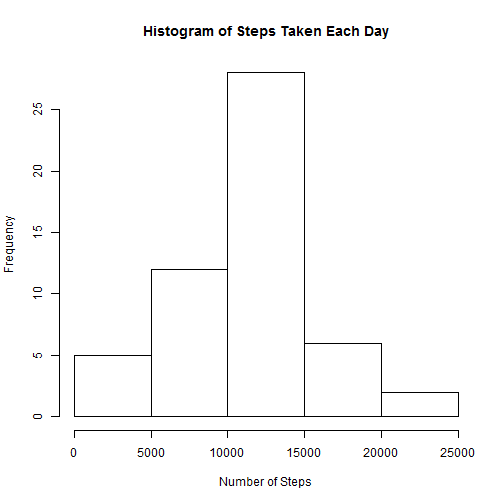
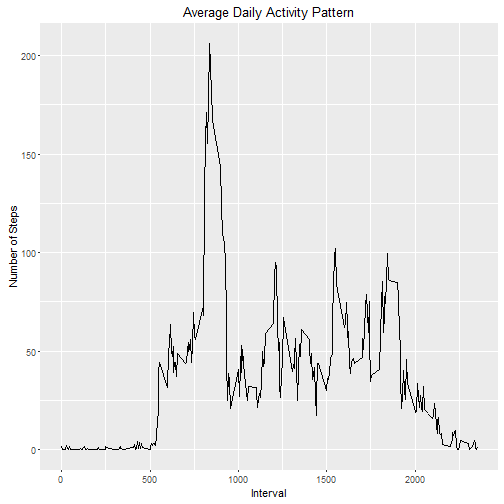
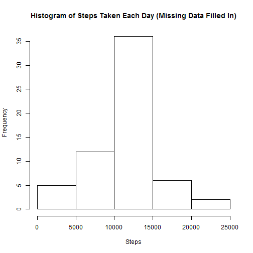
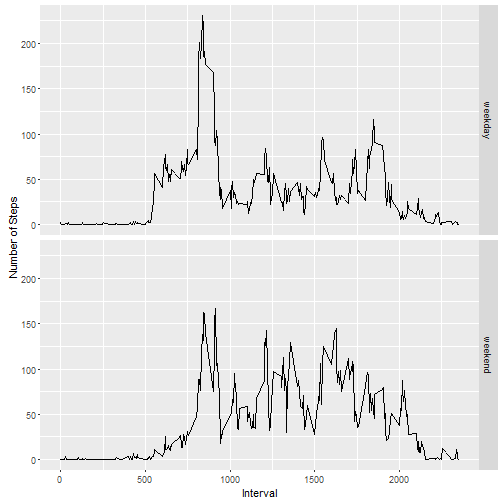

## Loading and preprocessing the data


```r
if (! file.exists("./project")) {dir.create("./project")}
fileUrl <- "https://d396qusza40orc.cloudfront.net/repdata%2Fdata%2Factivity.zip"
download.file(fileUrl, destfile = "./project/activity.zip")
unzip("./project/activity.zip", exdir = "./project")
activity <- read.csv("./project/activity.csv")
activity$date <- as.Date(activity$date, "%Y-%m-%d")
str(activity)
```

```
## 'data.frame':	17568 obs. of  3 variables:
##  $ steps   : int  NA NA NA NA NA NA NA NA NA NA ...
##  $ date    : Date, format: "2012-10-01" "2012-10-01" ...
##  $ interval: int  0 5 10 15 20 25 30 35 40 45 ...
```

## What is mean total number of steps taken per day?


```r
dayStep <- tapply(activity$steps, activity$date, sum)
hist(dayStep, main = "Histogram of Steps Taken Each Day", xlab = "Number of Steps")
```




```r
meanStep <- mean(tapply(activity$steps, activity$date, sum), na.rm = TRUE)
meanStep
```

```
## [1] 10766.19
```


```r
medianStep <- median(tapply(activity$steps, activity$date, sum), na.rm = TRUE)
medianStep
```

```
## [1] 10765
```

The mean of the total number of steps taken per day is 1.0766189 &times; 10<sup>4</sup>, and the median of the total number of steps taken per day is 10765.

## What is the average daily activity pattern?


```r
library(dplyr)
```

```
## 
## Attaching package: 'dplyr'
```

```
## The following objects are masked from 'package:stats':
## 
##     filter, lag
```

```
## The following objects are masked from 'package:base':
## 
##     intersect, setdiff, setequal, union
```

```r
library(ggplot2)
pattern <- activity %>%
        group_by(interval) %>%
        summarise(avg_steps = mean(steps, na.rm = TRUE))
g1 <- ggplot(pattern, aes(interval, avg_steps))
g1 + geom_line() + labs(title = "Average Daily Activity Pattern") + labs(x = "Interval", y = "Number of Steps")
```




```r
maxStep <- max(pattern$avg_steps)
maxStep
```

```
## [1] 206.1698
```

```r
maxInterval <- pattern$interval[match(maxStep, pattern$avg_steps)]
maxInterval
```

```
## [1] 835
```

So interval 835 contains the maximum number of steps, which is 206.1698113 steps.

## Imputing missing values


```r
NAcount <- sum(is.na(activity$steps))
NAcount
```

```
## [1] 2304
```


```r
activity_new <- mutate(activity, int_avg = factor(interval, pattern$interval, labels = pattern$avg_steps))
for (i in 1:nrow(activity_new)) {
        if (is.na(activity_new$steps[i])) {
                activity_new$steps[i] <- as.numeric(as.character(activity_new$int_avg[i]))
        }
}
```

As calculated above, there are totally 2304 missing values in the dataset. Here I used the mean for each 5-minute interval to fill in the NAs, and created a new dataset named activity_new.


```r
dayStep_new <- tapply(activity_new$steps, activity_new$date, sum)
hist(dayStep_new, main = "Histogram of Steps Taken Each Day (Missing Data Filled In)", xlab = "Steps")
```



As the sum of the average number of steps taken in each interval equals to the mean of daily steps, which is approximately 10766 steps, only the frequency of steps range 10000~15000 increased by 2304/288=8 days compared to the histgram before imputing missing values. The distribution of steps taken each day appears more centralized this way.


```r
meanStep_new <- mean(tapply(activity_new$steps, activity_new$date, sum), na.rm = TRUE)
meanStep_new
```

```
## [1] 10766.19
```

So the mean total number of steps taken per day is not impacted by imputing missing data this way.


```r
medianStep_new <- median(tapply(activity_new$steps, activity_new$date, sum), na.rm = TRUE)
medianStep_new
```

```
## [1] 10766.19
```

The median total number of steps taken per day is impacted and now equal to the mean value. The median occurs in a day with newly filled in data.

## Are there differences in activity patterns between weekdays and weekends?

```r
library(lubridate)
```

```
## 
## Attaching package: 'lubridate'
```

```
## The following object is masked from 'package:base':
## 
##     date
```

```r
activity_new$wday <- wday(activity_new$date)
activity_new$group[activity_new$wday[] == 1 | activity_new$wday[] == 7] <- "weekend"
activity_new$group[activity_new$wday[] >= 2 & activity_new$wday[] <= 6] <- "weekday"
activity_new$group <- as.factor(activity_new$group)
str(activity_new)
```

```
## 'data.frame':	17568 obs. of  6 variables:
##  $ steps   : num  1.717 0.3396 0.1321 0.1509 0.0755 ...
##  $ date    : Date, format: "2012-10-01" "2012-10-01" ...
##  $ interval: int  0 5 10 15 20 25 30 35 40 45 ...
##  $ int_avg : Factor w/ 288 levels "1.71698113207547",..: 1 2 3 4 5 6 7 8 9 10 ...
##  $ wday    : num  2 2 2 2 2 2 2 2 2 2 ...
##  $ group   : Factor w/ 2 levels "weekday","weekend": 1 1 1 1 1 1 1 1 1 1 ...
```

A new factor variable named group is created in the dataset with two levels ¨C ¡°weekday¡± and ¡°weekend¡± indicating whether a given date is a weekday or weekend day.


```r
groupData <- activity_new %>%
        group_by(group, interval) %>%
        summarise(group_avg = mean(steps))
g2 <- ggplot(groupData, aes(interval, group_avg))
g2 + geom_line() + facet_grid(group~.) + labs(x = "Interval", y = "Number of Steps")
```



As we can see from the panel plot, number of steps on weekday have an obvious peak in the morning, which I guess is the time that the tested person commutes to work.While on weekends, the peak is not so obvious.
